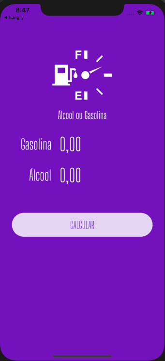

<h1 align="center">
   Calculadora de Combustível
</h1>

 

   <a href="#-projeto">Projeto</a>&nbsp;&nbsp;&nbsp;&nbsp;&nbsp;&nbsp;
 

 

    
 

 ## 💻 Projeto

App desenvolvido em Flutter para o cálculo de qual combustível é mais vantajoso para o abastecimento

 ---
<h4 align="center">
   Code and coffee ☕
</h4>
